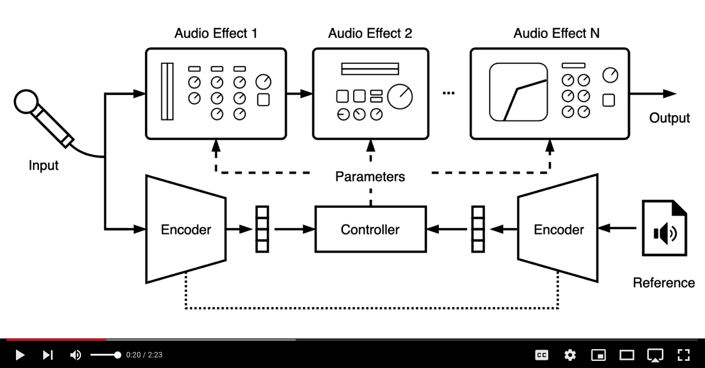

<div align="center">

# DeepAFx-ST
    
Style transfer of audio effects with differentiable signal processing


[](https://csteinmetz1.github.io/DeepAFx-ST)
[](TBD)
[](https://arxiv.org/abs/2207.08759)

<!--  -->
 
[Christian J. Steinmetz](http://Christiansteinmetz.com)<sup>1*</sup>, [Nicholas J. Bryan](https://ccrma.stanford.edu/~njb/)<sup>2</sup>, and [Joshua D. Reiss](http://www.eecs.qmul.ac.uk/~josh/)<sup>1</sup>

<sup>1</sup> Centre for Digital Music, Queen Mary University of London<br>
<sup>2</sup> Adobe Research <br>
<sup>*</sup>Work performed in-part while an intern at Adobe Research.


[](https://youtu.be/IZp455wiMk4)
    

</div>


<!-- START doctoc generated TOC please keep comment here to allow auto update -->
<!-- DON'T EDIT THIS SECTION, INSTEAD RE-RUN doctoc TO UPDATE -->
<!-- DON'T EDIT THIS SECTION, INSTEAD RE-RUN doctoc TO UPDATE -->

- [Abstract](#abstract)
- [Install & Usage](#install--usage)
- [Inference](#inference)
- [Training](#training)
- [Style evaluation](#style-evaluation)
- [License](#license)

<!-- END doctoc generated TOC please keep comment here to allow auto update -->
    
## Abstract
We present a framework that can impose the audio effects and production style from one recording to another by example with the goal of simplifying the audio production process.  We train a deep neural network to analyze an input recording and a style reference recording, and predict the control parameters of audio effects used to render the output.
In contrast to past work, we integrate audio effects as differentiable operators in our framework, perform backpropagation through audio effects, and optimize end-to-end using an audio-domain loss. We use a self-supervised training strategy enabling automatic control of audio effects without the use of any labeled or paired training data. We survey a range of existing and new approaches for differentiable signal processing, showing how each can be integrated into our framework while discussing their trade-offs. We evaluate our approach on both speech and music tasks, demonstrating that our approach generalizes both to unseen recordings and even to sample rates different than those seen during training. Our approach produces convincing production style transfer results with the ability to transform input recordings to produced recordings, yielding audio effect control parameters that enable interpretability and user interaction.

For more details, please see:
"[Style Transfer of Audio Effects with Differentiable Signal Processing](https://arxiv.org/abs/2207.08759)", [Christian J. Steinmetz](http://Christiansteinmetz.com), [Nicholas J. Bryan](https://ccrma.stanford.edu/~njb/), [Joshua D. Reiss](http://www.eecs.qmul.ac.uk/~josh/). arXiv, 2022. If you use ideas or code from this work, pleace cite our paper:

```BibTex
@article{steinmetz2022style,
      title={Style Transfer of Audio Effects with Differentiable Signal Processing}, 
      author={Christian J. Steinmetz and Nicholas J. Bryan and Joshua D. Reiss},
      year={2022},
      eprint={2207.08759},
      archivePrefix={arXiv},
      primaryClass={cs.SD}
}
```


## Install & Usage

Clone the repo, create a virtual environment, and then install the `deepafx_st` package.

```
cd <DeepAFx-ST>

# Option 1: Using virtual envs
python -m venv env/
source env/bin/activate

# Option 2: Using conda
conda create -n deepafx-st python=3.8 -y
conda activate deepafx-st


# Update pip and install
pip install --upgrade pip
pip install --pre -e .

# Optional if using AWS for data
pip install awscli

# Linux install
apt-get install libsndfile1
apt-get install sox
apt-get install ffmpeg
apt-get install wget
```

Download pretrained models and example files and untar in one shot
```Bash
cd <DeepAFx-ST>
wget https://github.com/adobe-research/DeepAFx-ST/releases/download/v0.1.0/checkpoints_and_examples.tar.gz -O - | tar -xz

```
Note, you can also find our pretrained checkpoints via the Github UI stored in a tagged release at [https://github.com/adobe-research/DeepAFx-ST/tags](https://github.com/adobe-research/DeepAFx-ST/tags).

After download and untar'ing, your `checkpoint` and `examples` folder structures should be the following:
```Bash
<DeepAFx-ST>/checkpoints/README.md
<DeepAFx-ST>/checkpoints/cdpam/
<DeepAFx-ST>/checkpoints/probes/
<DeepAFx-ST>/checkpoints/proxies/
<DeepAFx-ST>/checkpoints/style/
<DeepAFx-ST>/examples/voice_raw.wav
<DeepAFx-ST>/examples/voice_produced.wav
```


## Inference

Apply pre-trained models to your own audio examples with the `process.py` script.
Simply call the `scripts/process.py` passing your input audio `-i` along with your reference `-r` and the path to a pretrained model checkpoint `-c.

```
cd <DeepAFx-ST>
python scripts/process.py -i <input_audio>.wav -r <ref_audio>.wav -c <checkpoint.ckpt> 

# Speech models

# Autodiff speech model
python scripts/process.py -i examples/voice_raw.wav -r examples/voice_produced.wav -c ./checkpoints/style/libritts/autodiff/lightning_logs/version_1/checkpoints/epoch=367-step=1226911-val-libritts-autodiff.ckpt

# Proxy0 speech model
python scripts/process.py -i examples/voice_raw.wav -r examples/voice_produced.wav -c ./checkpoints/style/libritts/proxy0/lightning_logs/version_0/checkpoints/epoch\=327-step\=1093551-val-libritts-proxy0.ckpt

# Proxy2 speech model
python scripts/process.py -i examples/voice_raw.wav -r examples/voice_produced.wav -c ./checkpoints/style/libritts/proxy2/lightning_logs/version_0/checkpoints/epoch\=84-step\=283389-val-libritts-proxy2.ckpt 

# SPSA speech model
python scripts/process.py -i examples/voice_raw.wav -r examples/voice_produced.wav -c  checkpoints/style/libritts/spsa/lightning_logs/version_2/checkpoints/epoch\=367-step\=1226911-val-libritts-spsa.ckpt 

# TCN1 speech model
python scripts/process.py -i examples/voice_raw.wav -r examples/voice_produced.wav -c  checkpoints/style/libritts/tcn1/lightning_logs/version_1/checkpoints/epoch\=367-step\=1226911-val-libritts-tcn1.ckpt 

# TCN2 speech model
python scripts/process.py -i examples/voice_raw.wav -r examples/voice_produced.wav -c  checkpoints/style/libritts/tcn2/lightning_logs/version_1/checkpoints/epoch\=396-step\=1323597-val-libritts-tcn2.ckpt 

# Music models

# Autodiff music model
python scripts/process.py -i examples/voice_raw.wav -r examples/voice_produced.wav -c checkpoints/style/jamendo/autodiff/lightning_logs/version_0/checkpoints/epoch\=362-step\=1210241-val-jamendo-autodiff.ckpt

# Proxy0 music model
python scripts/process.py -i examples/voice_raw.wav -r examples/voice_produced.wav -c checkpoints/style/jamendo/proxy0/lightning_logs/version_0/checkpoints/epoch\=362-step\=1210241-val-jamendo-proxy0.ckpt 

# proxy0m music model 
python scripts/process.py -i examples/voice_raw.wav -r examples/voice_produced.wav -c checkpoints/style/jamendo/proxy0m/lightning_logs/version_0/checkpoints/epoch\=331-step\=276887-val-jamendo-proxy0.ckpt 

# Proxy2 music model
python scripts/process.py -i examples/voice_raw.wav -r examples/voice_produced.wav -c checkpoints/style/jamendo/proxy2/lightning_logs/version_0/checkpoints/epoch\=8-step\=30005-val-jamendo-proxy2.ckpt 

# Proxy2m music model
python scripts/process.py -i examples/voice_raw.wav -r examples/voice_produced.wav -c checkpoints/style/jamendo/proxy2m/lightning_logs/version_0/checkpoints/epoch\=341-step\=285227-val-jamendo-proxy2.ckpt

# SPSA music model
python scripts/process.py -i examples/voice_raw.wav -r examples/voice_produced.wav -c checkpoints/style/jamendo/spsa/lightning_logs/version_0/checkpoints/epoch\=362-step\=1210241-val-jamendo-spsa.ckpt 

# TCN1 music model
python scripts/process.py -i examples/voice_raw.wav -r examples/voice_produced.wav -c checkpoints/style/jamendo/tcn1/lightning_logs/version_0/checkpoints/epoch\=362-step\=1210241-val-jamendo-tcn1.ckpt 

# TCN2 music model
python scripts/process.py -i examples/voice_raw.wav -r examples/voice_produced.wav -c checkpoints/style/jamendo/tcn2/lightning_logs/version_0/checkpoints/epoch\=286-step\=956857-val-jamendo-tcn2.ckpt 

```

## Training

### Datasets

Training and evaluating the models will require one or more of the datasets. Download all the datasets with the following. 

```
python scripts/download.py --datasets daps vctk jamendo libritts musdb --output /path/to/output --download --process
```

You can download individual datasets if desired.

```
python scripts/download.py --datasets daps --output /path/to/output --download --process
```
Note, data download can take several days due to the dataset server speeds. We recommend downloading once and making your own storage setup. You will need approx. 1TB of local storage space to download and pre-process all datasets.

For the style classifcation task we need to render the synthetic style datasets. This can be done for DAPS and MUSDB18 using the [`scripts/run_generate_styles.sh`](scripts/run_generate_styles.sh) script. 
You will need to update the paths in this script to reflect your local file system and then call the script. 

```
./script/run_generate_styles.sh`
```

### Style transfer

A number of predefined training configurations are defined in bash scripts in the `configs/` directory.
We perform experiments on speech using [LibriTTS] and on music using the [MTG-Jamendo dataset](). 
By default, this will train 6 different model configurations using a different method for differentiable .
This will place one job on each GPU, and assumes at least 6 GPUs, each with at least 16 GB of VRAM.
You can launch training by calling the appropriate 

```
./configs/train_all_libritts_style.sh
./configs/train_all_jamendo_style.sh
```
Note, you will need to modify the data paths in the scripts above to fit your setup.

There are four main configurations for training the style transfer models. 
This is specified by the `--processor_model` flag when launching the training script, and
must be one of the following:

1. `tcn1` - End-to-end audio processing neural network (1 network) with control parameters.
2. `tcn2` - End-to-end audio processing neural network (2 networks) with control parameters.
3. `proxy0` - Neural network proxies with control parameters for audio processing.
4. `proxy2` - Neural network proxies with control parameters for audio processing.
5. `spsa` - Gradient estimation with DSP audio effects using SPSA methods.
6. `autodiff` - DSP audio effects implemnted directly in PyTorch.


### Proxy training

If desired you can also re-train the neural network audio effect proxies. 
Training the controller with neural proxies requires first pretrianing the proxy networks to emulate a parametric EQ and dynamic range compressor.
Calling the proxy pre-training scripts in the `configs/` directly will train these models using the training set from VCTK.

```
./configs/train_all_proxies.sh
```

### Probe training

Linear probes for the production style classification task can be trained with the following script.

```
./configs/train_all_probes.sh
```
Note, some additional data pre-processing is required and needs updating.

## Style evaluation

Evaluating the pretrained models along with the baselines is carried out with the `eval.py` script.
A predefined evaluation configuration to reproduce our results can be called as follows. 
Be sure to update the paths at the top of the script to reflect the location of the datasets. 

```
./configs/eval_style.sh
```

To evaluate a set of models call the script passing the directory containing the pretrained checkpoints.
The following example demonstrates evaluating models trained on daps.

### Probe evaluation

Pretrained linear probes can be evaluated separately with their own script.

```
./configs/eval_probes.sh
```

### Timing 

We compute timings on both CPU and GPU for the different approaches using `python scripts/timing.py`.

```
rb_infer : sec/step 0.0186    0.0037 RTF
dsp_infer : sec/step 0.0172    0.0034 RTF
autodiff_cpu_infer : sec/step 0.0295    0.0059 RTF
autodiff_gpu_infer : sec/step 0.0049    0.0010 RTF
tcn1_cpu_infer : sec/step 0.6580    0.1316 RTF
tcn2_cpu_infer : sec/step 1.3409    0.2682 RTF
tcn1_gpu_infer : sec/step 0.0114    0.0023 RTF
tcn2_gpu_infer : sec/step 0.0223    0.0045 RTF
autodiff_gpu_grad : sec/step 0.3086    0.0617 RTF
np_norm_gpu_grad : sec/step 0.4346    0.0869 RTF
np_hh_gpu_grad : sec/step 0.4379    0.0876 RTF
np_fh_gpu_grad : sec/step 0.4339    0.0868 RTF
tcn1_gpu_grad : sec/step 0.4382    0.0876 RTF
tcn2_gpu_grad : sec/step 0.6424    0.1285 RTF
spsa_gpu_grad : sec/step 0.4132    0.0826 RTF
```

The above results were from a machine with the following configuration. 

```
Intel(R) Xeon(R) CPU E5-2623 v3 @ 3.00GHz (16 core)
GeForce GTX 1080 Ti
```


## License
Unless otherwise specified via local comments per file, all code and models are licensed via the [Adobe Research License](LICENSE). Copyright (c) Adobe Systems Incorporated. All rights reserved.
